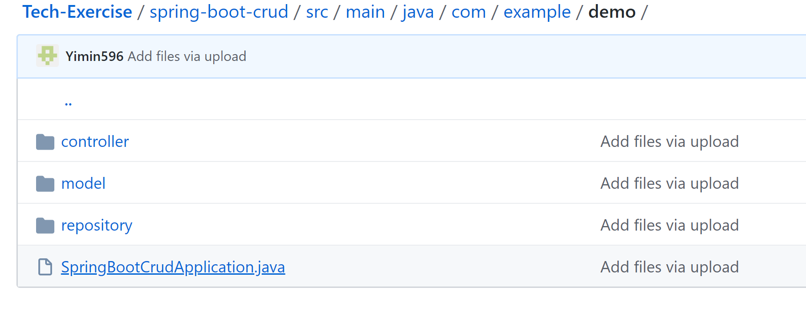

# Tech Execrise repository
Tech Exercise repository for CSCI4830 Software Engineering  
Owner: Yimin, Zijun

## Tech Exercise 2

Hello world, we are just following the tutorial of spring boot, and making some changes on Demo fold. 
Simply run the Demo1Application.java for showing the hello world in local server.

## Tech Exercise 3:
  
We simply made Folder spring-boot-crud by following the tutorial. 
URL: https://www.javaguides.net/2019/04/spring-boot-thymeleaf-crud-example-tutorial.html

